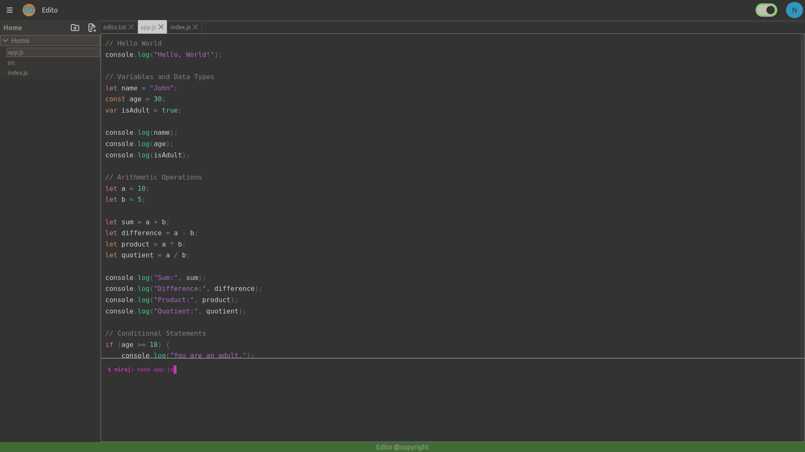

# Edito

Its a simple code editor with code writting functionality

## What it does
    * Code highlighting
    * code persistence in client machine
    * Simple signup & Login
    * Multi user file & folder management 
    * CRUD operation file and folder
    * Run client side js code through terminal (Not DOM or browser API);
    * Custom selection style

## Build

* Created using CRA (creat react app)
* `npm build`

## Deploy

`npm start`

**browse to edito**